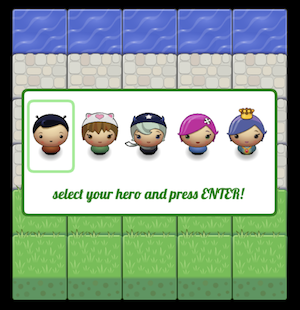
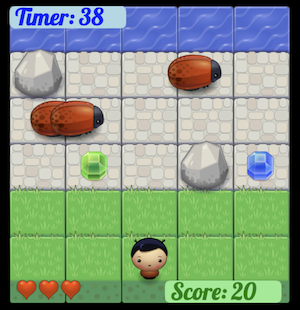

# Roach Panic - Arcade Game Clone

### The Game

**Roach Panic** is a simple browser based 2D-Game, where the player can choose the hero-character at the start. The goal is to reach 200 points within 1 minute by collecting gems, avoiding rocks and roaches and running repeatedly to the water.




### The Project

The source files are located in the `src` folder and the minimized production files in the `docs` folder. This is convenient for publishing on GitHub using [gh-pages](https://docs.github.com/en/pages/getting-started-with-github-pages/creating-a-github-pages-site). The task runner `gulp` is responsible for minimizing, prefixing, and copying the html, css, js, and static files to the `docs` folder.

This project was part of a Front End Development course by [Udacity](https://www.udacity.com/course/front-end-web-developer-nanodegree--nd0011) with parts of the game engine and the artwork given.

The code is purely based on `HTML5`, `CSS3` and vanilla `ES6 JavaScript` and a basic exercise in object-oriented programming.

### Development

Download the repo, cd into the project folder, install the dev dependencies and start gulp.

```
git clone https://github.com/thomasgrusz/roach-panic-game.git
cd roach-panic-game
npm i
npx gulp
```

`Gulp` will watch the source files and when changes are saved, it will start piping updated build files into the `docs` folder. From there I used the live-server extension in the [vscodium](https://vscodium.com/) code editor to hot reload the `docs` files into the browser.
